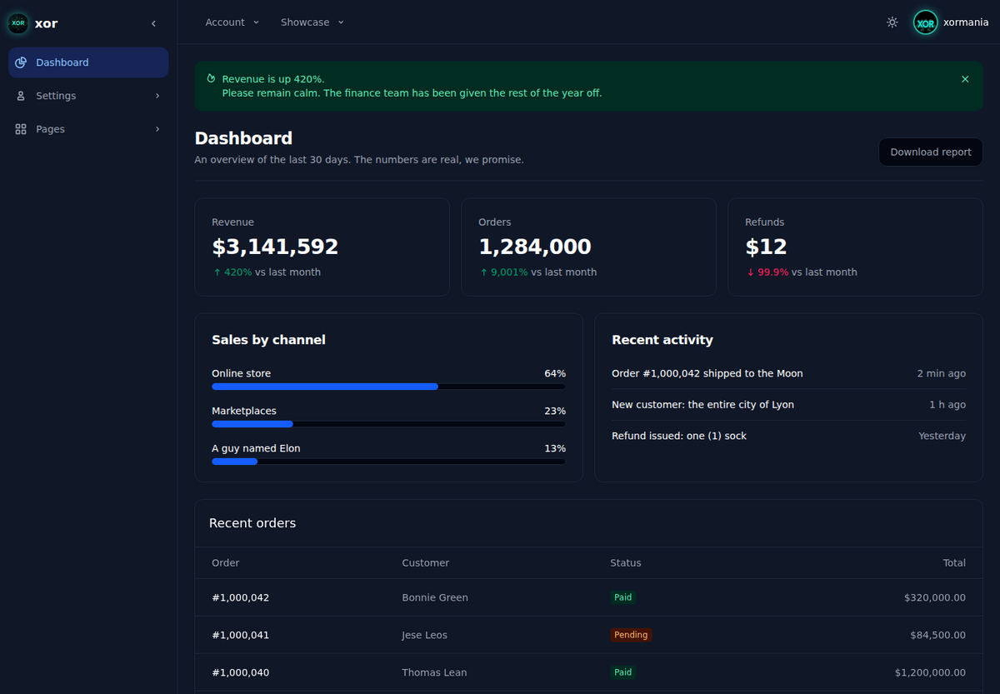

# flowbite-xor

A [Symfony UX Toolkit](https://symfony.com/bundles/ux-toolkit/current/index.html) kit built on the free
[Flowbite](https://flowbite.com/) v4 library and Tailwind CSS v4: a theme, Twig components, a form theme, page layouts
and ready-made blocks such as a login card or a dashboard, each one a recipe. `php bin/console ux:install` copies a
recipe into your project, where you own it. Every behavior is a Stimulus controller, so components keep working with
Turbo and Live Components. The [Gallery](https://xormania.github.io/flowbite-xor/) shows every recipe in light and
dark, with its code.



## Install

Requires PHP 8.4 or later with the `zip` extension (the toolkit unpacks GitHub's archive of the kit).
On a new project (`composer create-project symfony/skeleton`), run these once, in this order:

```bash
# 1. Allow Flex contrib recipes. Every component uses the `tailwind_classes` Twig filter, and a contrib
#    recipe enables its bundle (tales-from-a-dev/twig-tailwind-extra).
composer config extra.symfony.allow-contrib true
# 2. Twig and Twig components as regular dependencies. If they only come in with the toolkit (a dev
#    dependency), cache:clear fails with "non-existent service property_accessor".
composer require symfony/twig-bundle symfony/ux-twig-component
# 3. The toolkit, and the HTTP client it downloads the kit with.
composer require --dev symfony/ux-toolkit:^3.5 symfony/http-client
# 4. AssetMapper and StimulusBundle: the layouts load the `app` importmap entrypoint, and StimulusBundle
#    loads the recipes' controllers from assets/controllers/.
composer require symfony/asset-mapper symfony/stimulus-bundle
```

With [Symfony Docker](https://github.com/dunglas/symfony-docker), run these commands inside the container
(`docker compose exec php composer …`, `docker compose exec php bin/console …`); its PHP image has the `zip`
extension.

Then set up Tailwind CSS, Flowbite's stylesheet and the `theme` recipe as the *Tailwind CSS* and *Installation*
sections of [`INSTALL.md`](INSTALL.md) say (its *Symfony* steps are the commands above). After that, install recipes:

```bash
# from main: the last release
php bin/console ux:install <recipe> --kit=https://github.com/xormania/flowbite-xor

# from a release tag (`0.1.0`), a branch (`dev`: the work since the last release), or a full 40-character commit
# SHA (no "/": use the SHA for feat/x)
php bin/console ux:install <recipe> --kit=https://github.com/xormania/flowbite-xor:<version>
```

`ux:install` also installs the recipes a recipe depends on, then prints a `composer require` command for the
packages they need: run it. [Installing recipes](docs/GUIDE.md#installing-recipes) says more.

### Icons

The recipes show icons from the `flowbite` set of [UX Icons](https://symfony.com/bundles/ux-icons/current/index.html),
downloaded from the Iconify API the first time a page shows one. Before you deploy, save them in the project with
this command and commit them; run it again when your templates use new icons:

```bash
php bin/console ux:icons:lock
```

## Requirements

| | |
|---|---|
| Symfony UX Toolkit | ^3.5 (blocks need 3.5) |
| PHP | ≥ 8.4 (required by the toolkit), with the `zip` extension; `intl` for `calendar` and `date-picker` in any locale but `en` |
| Symfony | 7.4 LTS and 8.1: CI installs the kit on both (8.1 in a fresh Symfony Docker project), and the demo and its browser tests run on 8.1 |
| Assets | AssetMapper (`chart` also needs `chart.js` in the import map, which Flex adds; `editor` needs the Tiptap modules, which `ux:install` prints as `importmap:require` commands; `markdown-editor` needs `symfony/ux-live-component` for its preview). With Webpack Encore, override the layouts' `stylesheets` and `javascripts` blocks: they load the `app` importmap entrypoint |
| Tailwind CSS | 4.x |
| Flowbite | 4.x |

## Documentation

- [Recipes](docs/RECIPES.md): every recipe, one line each, linked to its README.
- [Guide](docs/GUIDE.md): installing and updating recipes, Turbo and Live Components, security, versioning.
- [`INSTALL.md`](INSTALL.md): each setup step explained, AssetMapper or Webpack Encore.
- Coding agents: give yours [`FOR-AGENTS.md`](FOR-AGENTS.md) and [`llms.txt`](llms.txt), and paste
  [`docs/PROJECT-AGENTS-SNIPPET.md`](docs/PROJECT-AGENTS-SNIPPET.md) into your project's `AGENTS.md` or `CLAUDE.md`.
- [`CHANGELOG.md`](CHANGELOG.md): what each version changes.
- [`CONTRIBUTING.md`](CONTRIBUTING.md): the repository layout, the checks and the conventions.
- [`docs/TESTING.md`](docs/TESTING.md): how the kit is tested, with patterns to reuse in your app's tests.

## License

MIT — see [`LICENSE`](LICENSE) and [`NOTICE`](NOTICE) (Symfony UX, Flowbite).
